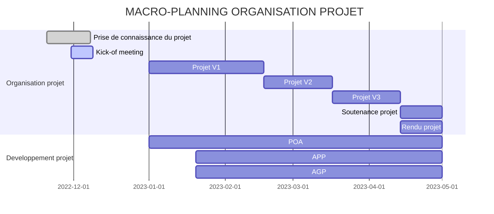
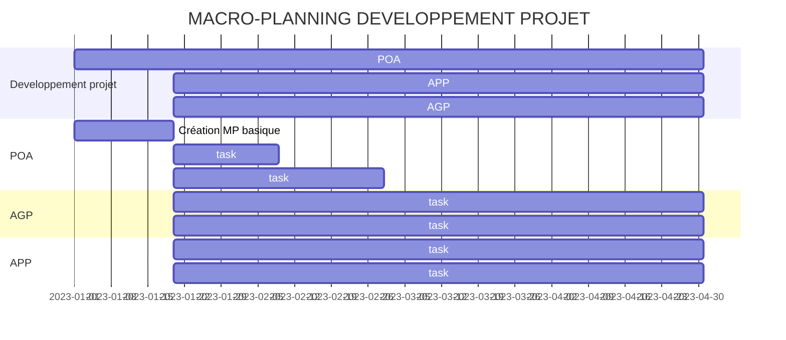

# Projet : Constitution dynamique d’un modèle de performance de voilier par apprentissage
**-Client :** M. Gilles LEPINARD 

Enseignant chercheur associé, Responsable projet Thales

Courriel: gilles.lepinard@master-developpement-logiciel.fr

**-Enseignant référent:** M. Gilles LEPINARD

**-Equipe Dual Boat** 

## Description et objectifs du projet
#### Contexte général

Aujourd'hui, la simulation est un outil essentiel à la réalisation de nombreux projets d'ingénieries de par son faible coût d'utilisation par rapport à des essais grandeur nature. C'est pourquoi l'utiliser sur des courses de voiliers semble intéressant, néanmoins sa conception n'est pas chose aisé et nécessite plusieurs disciplines. 

La nature du projet est de réaliser un simulateur de courses de voiliers, pour pouvoir à terme atteindre une automatisation complète de conduite d'un voilier (un drone) pour participer au **MicroTransat Challenge**. 

On peut découper cet objectif en plusieurs projets:

- Le simulateur lui même (coté utilisateur)
- L'organisateur de courses (coté manageur) 
- Constitution dynamique d’un modèle de performance de voilier par apprentissage

#### Contexte du projet

La « polaire » est le modèle comportemental couramment utilisé en course et en croisière pour prévoir la
vitesse d’un voilier. Il s’agit d’un simple tableau à deux entrées (la vitesse du vent vrai TWS et l’angle du
vent vrai TWS par rapport à l’axe du voilier) et à une sortie (la vitesse du voilier par rapport à l’eau STW).

La polaire est issue des calculs d’architecture navale mais est souvent bien éloignée des performances
réelles.
L’électronique embarqué au sein des voiliers permet en temps réel de mesurer les données des capteurs et
de les historiser.

A partir de ces données historisées et contextualisées il doit être possible de constituer un modèle de
performance par apprentissage. Le modèle ainsi obtenu serait alors directement utilisable pour les
prédictions ou pour générer les polaires du voilier.

#### Objectifs du projet

L’objectif du projet est
De mettre en place un processus outillé automatisé permettant à l’utilisateur de constituer par apprentissage
un modèle de performance à partir de fichiers d’enregistrements de trames caractérisés.
De fournir un applicatif permettant à l’utilisateur d’exploiter le modèle applicatif résultant afin de

- Comparer les performances réelles au performances prévues.
- Produire des polaires

Les besoins et contraintes du projet sont disponibles sur ce lien du  [backlog](https://docs.google.com/spreadsheets/d/16Uc-_3CkTmRhTnL7Bv5lchy09DF-uITX/edit?usp=sharing&ouid=103043773177032282236&rtpof=true&sd=true)

## Livrables du projet
|**Livrables organisation projet**|**Livrables développement projet**|
|--------|--------|
|   Présentation Kick-off meeting + Compte rendu   |   Processus outillé de génération de modèle de performance (**POA**)    |
|   Compte rendu réunion plan V1 | Application de génération de polaire (**AGP**)|
|Compte rendu réunion plan V2|    Application de prédiction de performance (**APP**)    |
|Compte rendu réunion plan V3  |

## Organisation du projet

### Rôles
L'essentiel du projet sera réalisé avec une approche itérative par ordre de priorité.
Nous travaillerons essentiellement en groupe et définirons au début de la réalisation du projet des responsables pour chaque livrable du développement.
- Responsable projet: Anaïs Bains
- Responsable POA: Morgan Lantrade
- Responsable AGP: Enguerran Couderc-Lafont
- Responsable APP: Justin Appel

### Communication
**Client-Fournisseur :**
- Discord : Pour les questions, retours et prise de décisions
- Github: Pour le suivi du projet, et les livrables
- Physique : Lors des réunions

**Equipe:**
- Discord
- Physique 

### Macro-planning organisation projet : 

## Développement du projet
Nous mettrons en priorité la réalisation d'un modèle de performance basique ( sans apprentissage) pour pouvoir débuter en parallèle les applications de génération de polaire et de prédictions.
### Processus outillé de génération de modèle de performance (POA)
Responsable: Morgan Lantrade

##### Activités principales:
- [ ]  Conversion d'enregistrements NMEA en fichier csv avec caractérisation.
- [ ]  Création d'un modèle de performance basique .
- [ ] Création visuel (dynamique?) pour analyse des données.
- [ ]   Création d'un modèle de performance par apprentissage.

##### Contraintes:
- Pouvoir choisir/ajouter un langage de l'interface : Français, Anglais,..
- Windows, Linux 64 bits et logiciels open source.
- Visualiser les paramètres d'entrées disponibles et pouvoir indiquer ceux qui sont exploités ( voir  L0 Backlog).
####  Application de  génération de polaire  (AGP)
Responsable: Enguerran Couderc-Lafont

##### Activités principales:
- [ ]  Création d'un fichier polaire à partir d'un modèle de performance (.pol) à partir d'un script python.
- [ ]  Création d'un outil d'analyse de polaire.

##### Activités secondaires:
- [ ]  Création d'une interface.

##### Contraintes:
- Pouvoir choisir/ajouter un langage de l'interface : Français, Anglais,..
- Windows, Linux 64 bits et logiciels open source
- Fonction python

####  Application de prédiction de performance (APP)
Responsable: Justin Appel

##### Activités principales:
- [ ]  Création d'un prédicteur de performance.
- [ ]  Création d'un outil d'analyse de performances.

##### Activités secondaires:
- [ ]  Création d'une interface 
##### Contraintes:
- Pouvoir choisir/ajouter un langage de l'interface : Français, Anglais,..
- Windows, Linux 64 bits et logiciels open source
- Fonction C ou C#

#### Outils de développement
| |**Processus outillé de génération de modèle de performance (POA)**|**Application de  génération de polaire  (AGP)**|**Application de prédiction de performance (APP)**|
|:--------:|:-----------|:-------------|:-----------|
|  **Langage**  | Python    |Python|C ou C#|
|  **Environnement**  |Windows et Linux 64    |Windows et Linux 64|Windows et Linux 64|
|  **Fichiers**  |   readme,config    |readme,config |readme,config |
 
##### Bibliothèques
- sklearn
- seaborn 
- matplotlib 
- pandas 
- numpy  
- à définir...
- 
### Processus du projet

### Macro-planning développement projet : 
A finir...

